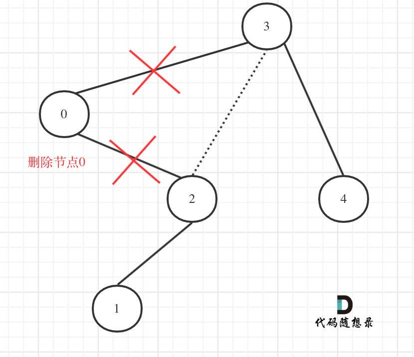

# Binary Tree

## 1 Definition 
> TreeNode.java  
> BinaryTree.java

### Description
`TreeNode.java`: The definition of tree node  
`BinaryTree.java`: The way of one dimensional array into tree structure

## 2 遍历 Traversal 
> RecursionTraversal.java   
> IterationTraversal.java 

### Description
`Recursion.java`: Preorder traversal, inorder traversal, and postorder traversal  
`Iteration.java`: Preorder traversal, inorder traversal, postorder traversal, breadth first search(DFS), and depth-first search(DFS)

### Recursive method and iterative method
1 For time complexity, the iterative method is similar to the recursive method (regardless of function call overhead and stack cost caused by function calls), but in terms of spatial complexity, recursion cost will be larger, because recursion requires the system stack to store parameter return values and so on.
2 For binary trees, depth-first search yields the same output as preorder traversal, and breadth first search yields the same output (one-dimension) as level traversal

## 2.1 遍历为基础的题
### 2.1.1叶子相关的
`SumOfLeftLeaves.java` 所有左叶子之和。  遍历 + 判断是否为左叶子
`findBottomLeftValue.java` 最后一行找到最左边的值。  层次遍历 + 判断最后一层最左边

### 2.1.2 路径类的
`BinaryTreePaths.java` 输出所有路径
`HasPathSum.java` 判断是否有这样的路径，使得路径和与targetSum相等， 存在返回TRUE， 反之FALSE
广度优先遍历（层次遍历） + Object
`PathSum.java` 是否有这样的路径，使得路径和与targetSum相等，找出所有路径。
广度优先遍历（层次遍历） + Object + String转list
直接用List压栈或入队，会把所有所有路径合并在一个list, 使用String来保存路径会好些。
类似“a->b” 这样的方式累加字符串 -> str.split("->")分割 -> 转Integer -> List<Integer>

### 2.1.3 深度相关
`maxDepth.java`  二叉树、N-叉树，思路差不多。 可递归，可迭代。  
> 可迭代
> 层次遍历+统计经历多少层
> 
> 可递归：
> 递归终止条件 if(root==null) return 0;
> 初始化： result = 0;
> 递归公式： 判断所以子树 + 拿result跟子树的高度（递归子树）比求最大值 
> 返回值：return result + 1; 当前节点的高度

`IsBalanced.java` 是否为平衡树， 递归遍历 + 
判断树的高度的基础上， 多一步判断，就是左右子树高度的差的绝对值是否为0或1
为了方便判断，可自定义为： 非平衡时树的高度为-1， 其他为平衡

### 2.1.4 最近公共祖先
`LowestCommonAncestor.java`
求最小公共祖先 ---->需要从底向上遍历
需要从底向上遍历，那么二叉树，只能通过后序遍历（即：回溯）实现从低向上的遍历方式
题目隐含的信息，在测试用例也是这样要求的： 注意p,q必然存在树内, 且所有节点的值唯一!!!

1、递归返回值子树是否p、q ，所以要么是 null 要么p 要么 q
if(node==null || node==p || node==q) return node;

2、后序遍历、先递归左右子树
TreeNode left = 递归node.left // 看看左子树的返回值
TreeNode right = 递归node.right // 看看右子树的返回值
左右子树返回什么。 自然是p、q、null
换句话说，递归的返回的是子树是否p、q

3、left、right情况分开处理： 注意p,q必然存在树内, 且所有节点的值唯一!!! 那么要判断是不是null,就可以了, 不必纠结p q 左子树还是右子树
当返回left、right有我们要p、q。 所以是只要left、right 非空，那么node就是我们要找得
情况有： 都不为空，其中一个为空，都为空
* 都不为空, p、q都找到了，对应node也就我们要的结果  return node
* left为空，right不为空 -> p、q在right里面，但不必纠结right到底是p还q -> 返回right
* left不为空，right为空 -> p、q在left里面，但不必纠结left到底是p还q -> 返回right
* 左右子树left、right返回值均为null, p和q均不在左右子树中, 没有p或q， 那么return null

## 2.2 构建树
都是要注意细节，保持统一取值范围，  [ 左闭右开 )
`BuilDTree.java` 前序中序构造树、 中序后序构造树
`constructMaximumBinaryTree.java`最大二叉树, 每次都用最至做根节点root，然后[左数组，root,右数组]； 然后root.left = 递归[左数组]. root.right = 递归[右数组]
`SortedArrayToBST.java`  跟构建最大二叉树差不多， 只不过root不是找最大值，而是找midIndex.

## 2.3 树的性质
### 2.3.1 完全二叉树
`CountNodes.java` 完全二叉树的节点个数,

### 2.3.2 二叉搜索树 BST
`searchBST.java` 在二叉搜索树中找节点
思路一：当普通树处理， 单纯遍历去找到节点
思路二-1：迭代 + 利用二叉搜索树的性质， 节点的左子树的所有元素 < 节点 < 节点的右子树的所有元素，
* node = root;  while(node!=null){...};
* 相等 return node;
* else if(val<node.val) node = node.left; // 结合while(node!=null) 这里不能多判断node.left!=null,否则会一直循环
* else if(val>node.val) node = node.right;
思路二-2：递归 + 利用二叉搜索树的性质
* if(root==null || root.val==val) return root;
* if (val < root.val) return searchBSTByRecursion(root.left, val); 
* if (val >root.val) return searchBSTByRecursion(root.right, val);
* return null;

`IsValidBST.java` 验证是不是二叉搜索树
利用二叉搜索树的性质： 二叉搜索树的中序遍历为递增序列
思路： 中序遍历得到序列 + 判断递增序列
需要注意 前者>=后者时，return false;  ——> 等于“=”也不是递增序列
必须保证中序遍历得到序列的前者<后者，才能满足递增序列

`getMinimumDifference.java` 找到最小绝对差值
利用二叉搜索树的性质： 二叉搜索树的中序遍历为递增序列
那么最小绝对差值，只能出现在递增序列的相邻两个元素中
思路： 中序遍历得到序列 + 在这个递增序列中找到相邻两个元素的最小绝对差值

`FindMode.java` 二叉搜索树中的众数， 这里的BST不是传统的，题目中重新定义了
思路一-1： 遍历 + 找频数最高
* 遍历不做限制
* 遍历的过程中，需要多做两件事，一个是map统计频数(节点值-频数)，另一个就是找到频数的最大值（maxCount）.
* map 找到频数（value） 等于 maxCount的节点值（key）
* 返回符合条件的key

思路一-2： 思路一-1的基础上， 不单单只是找频数的最大值，再多做一步清空list，之前list里的元素都失效了
与之对应，找频数最高前面，如果当前节点值的频数和最大频率maxCount相同，节点值放进list中

`LowestCommonAncestorInBST.java` 二叉搜索树的最近公共祖先
思路一： 当做普通树，`LowestCommonAncestor.java`一样

思路二：类似：`searchBST.java` 在二叉搜索树中找节点
利用二叉搜索树的性质：node左子树的所有元素 < node < node右子树的所有元素

迭代的话 ,当假设p<q时,node = root
* while(node!=null){...}; 继续循环
* node>p && node>q : node比 p q 都大， 我们要的结果就在左子树中，node = node.left; // 结合while(node!=null) 这里不能多判断node.left!=null,否则会一直循环
* node
p && node<q : 出现 p < node < q， 那么node就是我们要的结点。 return node
* node
q : 不存在这种情况，因为p大于q了， node就不可能同时小于p.又同时大于q
* node
q : 不存在这种情况，因为p大于q了， node就不可能同时小于p.又同时大于q
反之p>q时,p > node > q 也成立

递归的话，当假设p<q时, node = root
* node>p && node>q : node比 p q 都大， 我们要的结果就在递归左子树中。 递归左子树
* node
p && node<q : 出现 p < node < q， 那么node就是我们要的结点。 return node
* node
q : 不存在这种情况，因为p大于q了， node就不可能同时小于p.又同时大于q
反之p>q时,p > node > q 也成立

## 2.4 两棵树，double tree
迭代法中，一般一起操作两个树都是使用队列模拟类似层序遍历，同时处理两个树的节点，这种方式最好理解，
如果用模拟递归的思路的话，要复杂一些。

`IsSymmetric.java`  虽然是一棵树， 但是是将左右子树，分成了两边来判断的。
1、用栈或者队列
2、处理（判断）node1,node2:
* 情况一：node1为空 && node2点为空,continue(默认对称的情况)。因为node1(node2)的左右节点入队就没意义了(没后续可以入队了)，所以continue;
* 情况二：node1、node2有一个节点为空时 -> 不对称 -> 返回false
* 情况三：node1、node2都不为空但数值不相同 -> 不对称 -> 返回false
3、继续判断后面的节点。需要注意入队的顺序， node1.left、 node2.right、 node1.right、 node2.left

  
`MergeTrees.java` 合并两棵树
1、root1 root2只有一个空时， root1 null. 返回root2; root2 null. 返回root1  
notes： 或者两者都空时，返回root2时，就返回空了。  
2、不需要额外定义树！！！ root1为基础，返回求和后的root1  
3、循环判断，每次出队两个节点  
4、相加（前面排除了root1 root2 都为空的情况，而且后面处理是，也会保证node1,node2不为空）  
5、处理node1,node2的left和right  
* 情况一：压队（后面循环再进行求和）   ——> node1,node2的left和right都不空的时刻，都入队
* 情况二：赋值节点（整棵子树） ——> node2的left或者right不空， node1的left或者right为空，不空的node2的left或者right赋值过去。
* 情况三：不做操作 ——> 剩余情况，不做处理，没意义。

###

[1,3]
